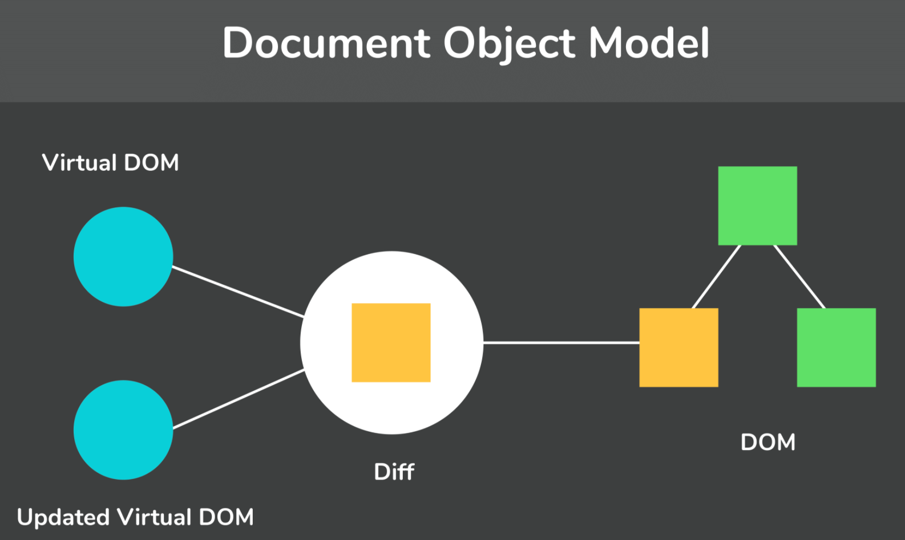

# React

## General Questions

**1. What are some advantages of using React?**  

- **Virtual DOM** React uses a Virtual DOM to render the view. As the name suggests, the Virtual DOM is a virtual representation of the real DOM. Each time the data changes in a React app, a new Virtual DOM gets created. Creating a Virtual DOM is much faster than rendering the UI inside the browser. Therefore, with the use of Virtual DOM, the efficiency of the app improves.  
  
- **Gentle Learning Curve** Anyone with knowledge of JS can easily learn React. It is much simpler to learn than other UI frameworks such as Angular.

- **SEO Friendly** React allows developers to develop engaging user interfaces that can be easily navigated in various search engines. It also allows server-side rendering, which boosts the SEO of an app.  

- **Reusable Components** React uses a component-based architecture for developing applications. Components are independent and reusable bits of code. These components can be shared across various applications having similar functionality. The re-use of components increases the pace of development.  

- **Huge Ecosystem of Libraries to Choose From**  React provides you the freedom to choose the tools, libraries, and architecture for developing an application based on your requirements.  

**2. Describe the thought process when building an application with React.**

1. **Break the UI into a component hierarchy.** The first thing you’ll want to do is to draw boxes around every component (and subcomponent) in the mock and give them all names. To decide what should be its own component: use the same techniques for deciding if you should create a new function or object. One such technique is the **single responsibility principle**, that is, a component should ideally only do one thing. If it ends up growing, it should be decomposed into smaller subcomponents.Separate your UI into components, where each component matches one piece of your data model.
2. **Build a Static Version in React.** Create a version with only props and no state. In simpler examples, it’s usually easier to go top-down, and on larger projects, it’s easier to go bottom-up and write tests as you build. At the end of this step, you’ll have a library of reusable components that render your data model. The components will only have `render()` methods since this is a static version of your app.
3. **Identify The Minimal (but complete) Representation Of UI State**
4. **Identify Where Your State Should Live**
5. **Add Inverse Data Flow**

## JSX

**1. What does JSX stand for?** JavaScript XML

**2. What is JSX?** It is a syntax extension to JS that produces React “elements”. 

**3. What does JSX allow us to do?** 

It allows us to write HTML-like code inside JavaScript and place them in the DOM without using functions like `appendChild( )` or `createElement( )`.
As stated in the official docs of React, JSX provides syntactic sugar for `React.createElement(component, props, ...children)` function.

**4. Can React applications be written without JSX?** Yes

**5. Give a code example of using JSX vs. not using JSX.** 

Without using JSX, we would have to create an element by the following process: 
```javascript
const text = React.createElement('p', {}, 'This is a text');
const container = React.createElement('div','{}',text );
ReactDOM.render(container,rootElement);
```
Using JSX, the above code can be simplified:
```javascript
const container = (
 <div>
   <p>This is a text</p>
 </div>
);
ReactDOM.render(container,rootElement);
```

**6. How can you embed expressions in JSX?** 

You can put any valid JavaScript expression inside the curly braces in JSX.

Example:
```javascript
function formatName(user) {
  return user.firstName + ' ' + user.lastName;
}

const user = {
  firstName: 'Harper',
  lastName: 'Perez'
};

const element = (
  <h1>
    Hello, {formatName(user)}!
  </h1>
);

ReactDOM.render(
  element,
  document.getElementById('root')
);
```

**7. What are some best practices for JSX?**
- Split JSX over multiple lines for readability.
- It is recommend to wrap it in parentheses to avoid the pitfalls of automatic semicolon insertion.

**8. After compilation, what does JSX evaluate to?**

After compilation, JSX expressions become regular JavaScript function calls and evaluate to JavaScript objects.

This means that you can use JSX inside of `if` statements and `for` loops, assign it to variables, accept it as arguments, and `return` it from functions:

Example:
```javascript
function getGreeting(user) {
  if (user) {
    return <h1>Hello, {formatName(user)}!</h1>;
  }
  return <h1>Hello, Stranger.</h1>;
}
```

**9. How can you specify attributes with JSX?** 

You can either:
1. Use quotes for string values (ex. `const element = <div tabIndex="0"></div>;` OR
2. Use curly braces for expressions (ex. `const element = </img>;`)

**10. How does JSX differ from HTML when specifying attribute names?**

React DOM uses `camelCase` property naming convention instead of HTML attribute names.

For example, `class` becomes `className` in JSX, and `tabindex` becomes `tabIndex`.

**11. If a tag is empty, can you close it immediately in JSX?**

Yes, you may close it immediately with `/>`, like XML.

Example:
```javascript
const element = ;
```

**12. Can JSX tags contain children?** Yes

Example: 
```javascript
const element = (
  <div>
    <h1>Hello!</h1>
    <h2>Good to see you here.</h2>
  </div>
);
```

**13. How does JSX prevent injection attacks?**

By default, React DOM escapes any values embedded in JSX before rendering them. Thus it ensures that you can never inject anything that’s not explicitly written in your application. Everything is converted to a string before being rendered. This helps prevent XSS (cross-site-scripting) attacks.

Example:
```javascript
const title = response.potentiallyMaliciousInput;
// This is safe:
const element = <h1>{title}</h1>;
```

## Elements

**1. What are React elements?**

Elements are the smallest building blocks of React apps.

An element describes what you want to see on the screen (ex. `const element = <h1>Hello, world</h1>;`) React reads these objects and uses them to construct the DOM and keep it up to date.

**2. What role does React.createElement() play?**

Babel compiles JSX down to `React.createElement()` calls.

These 2 are identical:

JSX
```javascript 
  const element = (
  <h1 className="greeting">
    Hello, world!
  </h1>
);
```

React Create Element
```javascript 
const element = React.createElement(
  'h1',
  {className: 'greeting'},
  'Hello, world!'
);
```

`React.createElement()` creates an object like that is called a **React element**: 
```javascript
// Note: this structure is simplified
const element = {
  type: 'h1',
  props: {
    className: 'greeting',
    children: 'Hello, world!'
  }
};
```

**3. How do elements differ from components?**

Elements are what components are “made of”.

**4. How many root DOM nodes does a typical application have?**

Applications built with just React usually have a single root DOM node. If you are integrating React into an existing app, you may have as many isolated root DOM nodes as you like.

**5. How do you render a React element on the DOM?** 

To render a React element into a root DOM node, pass both to `ReactDOM.render()`.

```javascript
const element = <h1>Hello, world</h1>;
ReactDOM.render(element, document.getElementById('root'));
```

In practice, most React apps only call `ReactDOM.render()` once.

**6. What is an immutable object?**

An object whose state cannot be modified after it is created.

**7. Are React object mutable or immutable? Explain.** 

React elements are **immutable**. Once you create an element, you can’t change its children or attributes. An element is like a single frame in a movie: it represents the UI at a certain point in time.

**8. What is the only way to update the UI?** 

By creating a new element, and passing it to `ReactDOM.render()`.

**9. How does React decide what to update in the DOM?**

React DOM compares the element and its children to the previous one, and only applies the DOM updates necessary to bring the DOM to the desired state.

## Virtual DOM

**1. What is the Virtual DOM? How does React use the Virtual DOM to render the UI?** 

The virtual DOM (VDOM) is a programming concept where an ideal, or “virtual”, representation of a UI is kept in memory and synced with the “real” DOM by a library such as ReactDOM. This process is called **reconciliation**.   



**2. Why was the Virtual DOM introduced?** 

DOM manipulation is an integral part of any web application, but DOM manipulation is quite slow when compared to other operations in JavaScript.  

The efficiency of the application gets affected when several DOM manipulations are being done. Most JavaScript frameworks update the entire DOM even when a small part of the DOM changes.  

For example, consider a list that is being rendered inside the DOM. If one of the items in the list changes, the entire list gets rendered again instead of just rendering the item that was changed/updated. This is called **inefficient updating**.

To address the problem of inefficient updating, the React team introduced the concept of virtual DOM.

**3. How does the Virtual DOM work?** 

For every DOM object, there is a corresponding virtual DOM object(copy), which has the same properties.

The main difference between the real DOM object and the virtual DOM object is that any changes in the virtual DOM object will not reflect on the screen directly. The virtual DOM object is like a  blueprint of the real DOM object.

Whenever a JSX element gets rendered, every virtual DOM object gets updated.

React uses two virtual DOMs to render the user interface. One of them is used to store the current state of the objects and the other to store the previous state of the objects.
Whenever the virtual DOM gets updated, React compares the two virtual DOMs and gets to know about which virtual DOM objects were updated.
After knowing which objects were updated, React renders only those objects inside the real DOM instead of rendering the complete real DOM. This way, with the use of virtual DOM, react solves the problem of inefficient updating.

**4. Is updating the Virtual DOM object inefficient?**

No, updating the virtual DOM is much faster than updating the real DOM since we are just updating the blueprint of the real DOM.

## Components and Props

**1. What are Components in React?**

Components let you split the UI into independent, reusable pieces, and think about each piece in isolation. 

Conceptually, components are like JavaScript functions. They accept arbitrary inputs (called “props”) and return React elements describing what should appear on the screen.

**2. What are props?**

Elements not only can represent DOM elements, but also user-defined components. When React sees an element representing a user-defined component, it passes JSX attributes and children to this component as a single object. We call this object **“props”**.

```javascript
function Welcome(props) {
  return <h1>Hello, {props.name}</h1>;
}

const element = <Welcome name="Sara" />;
ReactDOM.render(
  element,
  document.getElementById('root')
);
```

**3. What is the expected letter-casing of a component?** 

Always start with a capital letter. 

This is because React treats components starting with lowercase letters as DOM tags. For example, `<div />` represents an HTML div tag, but `<Welcome />` represents a component and requires Welcome to be in scope.

**4. How do you determine good candidates to be extracted out as separate components?**

A good rule of thumb is that if a part of your UI is used several times (Button, Panel, Avatar), or is complex enough on its own (App, FeedStory, Comment), it is a good candidate to be extracted to a separate component.

**5. What are pure functions vs. impure functions?**

**Pure functions** do not attempt to change their inputs, and always return the same result for the same inputs.

```javascript
function sum(a, b){
  return a + b;
}
```

**Impure functions** changes its own input.
```javascript
function withdraw(account, amount) {
  account.total -= amount;
}
```

**6. What is the most important rule React has with regards to props?** 

Props are read-only. All React components must act like pure functions with respect to their props.

**7. What can be done in React as a workaround to having read-only props?**

State can be utilized. State allows React components to change their output over time in response to user actions, network responses, and anything else, without violating this rule.

State is similar to props, but it is private and fully controlled by the component.

## Functional vs. Class Components

**1. What is a functional component?**

A JavaScript function that accepts props (properties) and returns a React element. These are valid React components.

```javascript
function Welcome(props) {
  return <h1>Hello, {props.name}</h1>;
}
```

**2. What is a class component?** 

An ES6 class that extends from React.Component. This is also a valid React component.

```javascript
class Welcome extends React.Component {
  render() {
    return <h1>Hello, {this.props.name}</h1>;
  }
}
```

**3. How did the 2 compare before the introduction of hooks?** 

Functional components were stateless components whereas class components were stateful.

**4. What are some ways the 2 compare?** 

| Topic | Functional Component | Class Component |
|:--: | :--| :--| 
| Decalaration | Functional components are nothing but JavaScript functions and therefore can be declared using an **arrow function** or the **function** keyword.| Are declared using the ES6 class. |
| Handling props | Any prop provided as an argument to a functional component, can be directly used inside HTML elements. | `this` keyword is used. |
| Handling state | Functional components use React hooks to handle state. It uses the useState hook to set state of a variable inside the component. Since useState hook returns an array of two items, the first item contains the current state, and the second item is a function used to update the state. | We cannot use React Hooks inside class components. For reading the state, use `this.state.`. For updating the state, we need to first bind the function to `this`. Only then, we will be able to use the `setState` function which is used to update the state. Alternatively, an arrow function can be used to avoid the need to bind. Then the arrow function can be accessed via `this.functionName()` | 

Example of Functional Components: 
```javascript
function card(props){
 return(
   <div className="main-container">
     <h2>Title of the card</h2>
   </div>
 )
}

const card = (props) =>{
 return(
   <div className="main-container">
     <h2>Title of the card</h2>
   </div>
 )
}
```

Example of a Class Component: 
```javascript
class Card extends React.Component{
 constructor(props){
   super(props);
 }

 render(){
   return(
     <div className="main-container">
       <h2>Title of the card</h2>
     </div>
   )
 }
}
```

**5. Give an example of how props are handled by functional components vs class components.**

If given the following prop:

`<StudentInfo name="Mridula" rollNumber="23" />`

In a functional component:
```javascript
function StudentInfo(props){
 return(
   <div className="main">
     <h2>{props.name}</h2>
     <h4>{props.rollNumber}</h4>
   </div>
 )
 ```

In a class component:
```javascript
class StudentInfo extends React.Component{
 constructor(props){
   super(props);
 }

 render(){
   return(
     <div className="main">
       <h2>{this.props.name}</h2>
       <h4>{this.props.rollNumber}</h4> 
     </div>
   )
 }
}
```

**6. Give an example of how state is handled in a functional component vs. a class component.**

State in a Functional Component:
```javascript
function ClassRoom(props){
 let [studentsCount,setStudentsCount] = useState(0);

 const addStudent = () => {
   setStudentsCount(++studentsCount);
 }
 return(
   <div>
     <p>Number of students in class room: {studentsCount}</p>
     <button onClick={addStudent}>Add Student</button>
   </div>
 )
}
```

State in a Class Component:
```javascript
class ClassRoom extends React.Component{
          constructor(props){
            super(props);
            this.state = {studentsCount : 0};
         
            this.addStudent = this.addStudent.bind(this);
          }
         
          addStudent(){
            this.setState((prevState)=>{
              return {studentsCount: prevState.studentsCount++}
            });
          }

          const useArrowFunctionToAvoidBinding = () => {
            return <h1>Hello</h1>;
          }
         
          render(){
            return(
              <div>
              {useArrowFunctionToAvoidBinding()}
                <p>Number of students in class room: {this.state.studentsCount}</p>
                <button onClick={this.addStudent}>Add Student</button>
              </div>
            )
          }
         }
```

## State and Lifecycle Methods

**1. What is mounting?**

Its when a component is rendered to the DOM for the first time.

**2. What is unmounting?**

Its whenever the DOM produced by a component is removed.

**3. What are 3 important rules about `setState()`?**

1) Do not modify state directly.

   - The only place where you can assign `this.state` is the constructor.
   - This is the wrong way to update state. It will not re-render a component: `this.state.comment = 'Hello';`
   - This is the correct way to update state: `this.setState({comment: 'Hello'});`


2) State updates may be asynchronous.

React may batch multiple `setState()` calls into a single update for performance. Because `this.props` and `this.state` may be updated asynchronously, you should not rely on their values for calculating the next state. Thats why code like below may fail to update the counter.

```javascript
this.setState({
  counter: this.state.counter + this.props.increment,
});
``` 

To fix it, use a second form of `setState()` that accepts a function rather than an object. That function will receive the previous state as the first argument, and the props at the time the update is applied as the second argument.

You can use either an arrow function or a regular function.

```javascript
// Arrow function:
this.setState((state, props) => ({
  counter: state.counter + props.increment
}));

// Regular function:
this.setState(function(state, props) {
  return {
    counter: state.counter + props.increment
  };
});
```

3) State updates are merged.

- This means that when you call `setState()`, React merges the object you provide into the current state.
- For example, your state may contain several independent variables, but then you can update them independently with separate setState() calls.
- The merging is shallow, so, for example, `this.setState({comments})` leaves `this.state.posts` intact, but completely replaces `this.state.comments`.

```javascript
// Original state set in the constructor of a class component:
constructor(props) {
    super(props);
    this.state = {
      posts: [],
      comments: []
    };
  }

// Setting state of posts:
componentDidMount() {
    fetchPosts().then(response => {
      this.setState({
        posts: response.posts
      });
    });
// Then, setting state of comments:
    fetchComments().then(response => {
      this.setState({
        comments: response.comments
      });
    });
  }
```

**4. In which direction does data flow in a React app?**

React apps have a “top-down” or “unidirectional” data flow. 

Any state is always owned by some specific component, and any data or UI derived from that state can only affect components “below” them in the tree.

**5. Why is state called local or encapsulated?** 

Neither parent nor child components can know if a certain component is stateful or stateless, and they shouldn’t care whether it is defined as a function or a class.

This is why state is often called local or encapsulated. It is not accessible to any component other than the one that owns and sets it.

**6. How can a component pass its state to child components?**

A component may choose to pass its state down as props to its child components. The child will not know it was a state (ex. `<FormattedDate date={this.state.date} />`).

## Handling Events

**1. What are some differences between handling events in DOM elements vs React elements?**

| React Elements | DOM Elements |
|:-- |:--|
| React events are named using camelCase. | DOM elements are lowercase. |
| With JSX you pass a function as the event handler.  | DOM elements you pass a string. |
| You cannot return false to prevent default behavior in React. You must call preventDefault explicitly. | In HTML, you can. | 
| When using React, you generally don’t need to call addEventListener to add listeners to a DOM element after it is created. Instead, just provide a listener when the element is initially rendered. | In HTML, you need to addEventListener. |

```javascript
// HTML syntax:
<button onclick="activateLasers()">
  Activate Lasers
</button>

// React syntax:
<button onClick={activateLasers}>
  Activate Lasers
</button>

// HTML onclick:
<a href="#" onclick="console.log('The link was clicked.'); return false">
  Click me
</a>

// React onClick:
function ActionLink() {
  function handleClick(e) { // e is a synthetic event.
    e.preventDefault();
    console.log('The link was clicked.');
  }

  return (
    <a href="#" onClick={handleClick}>
      Click me
    </a>
  );
}
```

**2. What is the common pattern followed for event handlers in React in a class component?**

When you define a component using an ES6 class, a common pattern is for an event handler to be a method on the class. For example, this Toggle component renders a button that lets the user toggle between “ON” and “OFF” states:

```javascript
class Toggle extends React.Component {
  constructor(props) {
    super(props);
    this.state = {isToggleOn: true};

    // This binding is necessary to make `this` work in the callback
    /*
    You have to be careful about the meaning of this in JSX callbacks. In JavaScript, class methods are not bound by default. If you forget to bind this.handleClick and pass it to onClick, this will be undefined when the function is actually called.

    This is not React-specific behavior; it is a part of how functions work in JavaScript. Generally, if you refer to a method without () after it, such as onClick={this.handleClick}, you should bind that method.
    */ 
    this.handleClick = this.handleClick.bind(this);
  }

  handleClick() {
    this.setState(state => ({
      isToggleOn: !state.isToggleOn
    }));
  }

  render() {
    return (
      <button onClick={this.handleClick}>
        {this.state.isToggleOn ? 'ON' : 'OFF'}
      </button>
    );
  }
}

ReactDOM.render(
  <Toggle />,
  document.getElementById('root')
);
```

**3. What are 2 alternatives to avoid having to bind this?**

1) If you are using the experimental public class fields syntax, you can use class fields to correctly bind callbacks:

```javascript
class LoggingButton extends React.Component {
  // This syntax ensures `this` is bound within handleClick.
  // Warning: this is *experimental* syntax.
  handleClick = () => {
    console.log('this is:', this);
  }

  render() {
    return (
      <button onClick={this.handleClick}>
        Click me
      </button>
    );
  }
}
```

2) If you aren’t using class fields syntax, you can use an arrow function in the callback. 

The problem with this syntax is that a different callback is created each time the LoggingButton renders. In most cases, this is fine. However, if this callback is passed as a prop to lower components, those components might do an extra re-rendering. This is a performance problem.

```javascript
class LoggingButton extends React.Component {
  handleClick() {
    console.log('this is:', this);
  }

  render() {
    // This syntax ensures `this` is bound within handleClick
    return (
      <button onClick={() => this.handleClick()}>
        Click me
      </button>
    );
  }
}
```

**4. What is the recommended ways of binding?** In the constructor or using the class fields syntax.

**5. What are 2 ways you can pass arguments to event handlers?**

1) Using arrow functions.
2) Using Function.prototype.bind. 

```javascript
// Arrow function:
<button onClick={(e) => this.deleteRow(id, e)}>Delete Row</button>

// Function.prototype.bind:
<button onClick={this.deleteRow.bind(this, id)}>Delete Row</button>
```

In both cases, the e argument representing the React event will be passed as a second argument after the ID. With an arrow function, we have to pass it explicitly, but with bind any further arguments are automatically forwarded.

## Conditional Rendering

**1. How can you achieve conditional rendering in React?**

It is the same as JS. Here are 7 possibilities:

1. Using an `if-else` statement.
2. You can use variables to store elements (**element variables**). This can help you conditionally render a part of the component while the rest of the output doesn’t change.
3. Using a `switch` statement.
4. Using **conditional/ternary operators**: `condition ? true : false`
5. Using **short circuit evaluation**: `{condition && <tag>content</tag>}`
6. Using enhanced JSX libraries (ex. the babel plugin JSX Control Statements) Note that this way is not recommended.
7. Using immediately invoked function expressions (IIFEs)

```javascript
(function () {
  // statements
})();
```

Remember that whenever conditions become too complex, it might be a good time to extract a component.

**2. How do you prevent a component from rendering in React?**

In rare cases you might want a component to hide itself even though it was rendered by another component. To do this return `null` instead of its render output.

```javascript
function WarningBanner(props) {
  if (!props.warn) {
    return null;
  }

  return (
    <div className="warning">
      Warning!
    </div>
  );
}
```

## Lists & Keys

**1. How can you render multiple components from an array?** 

You can loop through an array using the JS map function.

```javascript
const numbers = [1, 2, 3, 4, 5];
const listItems = numbers.map((number) =>
  <li>{number}</li>
);

// rendering:
ReactDOM.render(
  <ul>{listItems}</ul>,
  document.getElementById('root')
);
```

Usually you would render lists inside a component. A **key** is required in lists. A “key” is a special string attribute you need to include when creating lists of elements.

A good rule of thumb is that elements inside the `map()` call need keys.

```javascript
function NumberList(props) {
  const numbers = props.numbers;
  const listItems = numbers.map((number) =>
    <li key={number.toString()}>
      {number}
    </li>
  );
  return (
    <ul>{listItems}</ul>
  );
}

const numbers = [1, 2, 3, 4, 5];
ReactDOM.render(
  <NumberList numbers={numbers} />,
  document.getElementById('root')
);
```

**2. What is the purpose of keys?**

Keys help React identify which items have changed, are added, or are removed. Keys should be given to the elements inside the array to give the elements a stable identity. 

**3. What is the best way to pick a key?**

The best way to pick a key is to use a string that uniquely identifies a list item among its siblings. Most often you would use IDs from your data as keys. 

```javascript
const todoItems = todos.map((todo) =>
  <li key={todo.id}>
    {todo.text}
  </li>
);
```

**4. Why is using item index's not recommended as keys?**

Its not recommended to use indexes for keys if the order of items may change. This can negatively impact performance and may cause issues with component state. 

It may break your application and display wrong data!

A key is the only thing React uses to identify DOM elements. What happens if you push an item to the list or remove something in the middle? If the key is same as before React assumes that the DOM element represents the same component as before. But that is no longer true.

**5. What does React use as default as a key?**

If you choose not to assign an explicit key to list items then React will default to using indexes as keys.

**6. Do keys need to be unique globally?** 

No.Keys used within arrays should be unique among their siblings. However they don’t need to be globally unique. We can use the same keys when we produce two different arrays.

**7. How do you pass keys to your components?** 

Keys serve as a hint to React but they don’t get passed to your components. If you need the same value in your component, pass it explicitly as a prop with a different name. In the example below,  the Post component can read `props.id`, but not `props.key`.

```javascript
const content = posts.map((post) =>
  <Post
    key={post.id}
    id={post.id}
    title={post.title} />
);
```
## Forms

**1. What is a controlled component?**

In HTML, form elements such as `<input>`, `<textarea>`, and `<select>` typically maintain their own state and update it based on user input. In React, mutable state is typically kept in the state property of components, and only updated with `setState()`.

We can combine the two by making the React state be the “single source of truth”. Then the React component that renders a form also controls what happens in that form on subsequent user input. An input form element whose value is controlled by React in this way is called a “controlled component”.

With a controlled component, the input’s value is always driven by the React state. While this means you have to type a bit more code, you can now pass the value to other UI elements too, or reset it from other event handlers.

```javascript
/*
Since the value attribute is set on our form element, the displayed value will always be this.state.value, making the React state the source of truth. Since handleChange runs on every keystroke to update the React state, the displayed value will update as the user types.
*/
class NameForm extends React.Component {
  constructor(props) {
    super(props);
    this.state = {value: ''};

    this.handleChange = this.handleChange.bind(this);
    this.handleSubmit = this.handleSubmit.bind(this);
  }

  handleChange(event) {
    this.setState({value: event.target.value});
  }

  handleSubmit(event) {
    alert('A name was submitted: ' + this.state.value);
    event.preventDefault();
  }

  render() {
    return (
      <form onSubmit={this.handleSubmit}>
        <label>
          Name:
          <input type="text" value={this.state.value} onChange={this.handleChange} />
        </label>
        <input type="submit" value="Submit" />
      </form>
    );
  }
}
```

**2. How does the textarea tag differ in HTML vs React?**

In HTML, a `<textarea>` element defines its text by its children:

```html
<textarea>
  Hello there, this is some text in a text area
</textarea>
```

In React, a `<textarea>` uses a value attribute instead. This way, a form using a `<textarea>` can be written very similarly to a form that uses a single-line input:

```javascript
class EssayForm extends React.Component {
  constructor(props) {
    super(props);
    this.state = {
      value: 'Please write an essay about your favorite DOM element.'
    };

    this.handleChange = this.handleChange.bind(this);
    this.handleSubmit = this.handleSubmit.bind(this);
  }

  handleChange(event) {
    this.setState({value: event.target.value});
  }

  handleSubmit(event) {
    alert('An essay was submitted: ' + this.state.value);
    event.preventDefault();
  }

  render() {
    return (
      <form onSubmit={this.handleSubmit}>
        <label>
          Essay:
          <textarea value={this.state.value} onChange={this.handleChange} />
        </label>
        <input type="submit" value="Submit" />
      </form>
    );
  }
}
```

**2. How does the select tag differ in HTML vs React?**

In HTML, `<select>` creates a drop-down list. For example, this HTML creates a drop-down list of flavors:

```html
<select>
  <option value="grapefruit">Grapefruit</option>
  <option value="lime">Lime</option>
  <option selected value="coconut">Coconut</option>
  <option value="mango">Mango</option>
</select>
```
Note that the Coconut option is initially selected, because of the `selected` attribute. React, instead of using this `selected` attribute, uses a `value` attribute on the root `select` tag. This is more convenient in a controlled component because you only need to update it in one place. For example:

```javascript
class FlavorForm extends React.Component {
  constructor(props) {
    super(props);
    this.state = {value: 'coconut'};

    this.handleChange = this.handleChange.bind(this);
    this.handleSubmit = this.handleSubmit.bind(this);
  }

  handleChange(event) {
    this.setState({value: event.target.value});
  }

  handleSubmit(event) {
    alert('Your favorite flavor is: ' + this.state.value);
    event.preventDefault();
  }

  render() {
    return (
      <form onSubmit={this.handleSubmit}>
        <label>
          Pick your favorite flavor:
          <select value={this.state.value} onChange={this.handleChange}>
            <option value="grapefruit">Grapefruit</option>
            <option value="lime">Lime</option>
            <option value="coconut">Coconut</option>
            <option value="mango">Mango</option>
          </select>
        </label>
        <input type="submit" value="Submit" />
      </form>
    );
  }
}
```

**3. How can you select multiple options in a React select?**

You can pass an array into the `value` attribute, allowing you to select multiple options in a `select` tag.

```javascript
<select multiple={true} value={['B', 'C']}>
```

**4. Why is the file tag considered to be an uncontrolled component?**

Because its value is **read-only**, it is an uncontrolled component in React. 

In HTML, an `<input type="file">` lets the user choose one or more files from their device storage to be uploaded to a server or manipulated by JavaScript via the File API.

**5. What is a popular library for a fully-fledged solution of handling forms in React?**

Formik - it is a complete solution including validation, keeping track of the visited fields, and handling form submission, etc.

**6. What is an alternative to controlled components?**

Uncontrolled components (though controlled are recommended).

It can sometimes be tedious to use controlled components, because you need to write an event handler for every way your data can change and pipe all of the input state through a React component. This can become particularly annoying when you are converting a preexisting codebase to React, or integrating a React application with a non-React library. In these situations, you might want to check out uncontrolled components, an alternative technique for implementing input forms.

**7. What would prevent a user from changing an input on a controlled component?**

Specifying the value prop on a controlled component prevents the user from changing the input unless you desire so. 

**8. What is one way of handling multiple inputs?**

When you need to handle multiple controlled input elements, you can add a name attribute to each element and let the handler function choose what to do based on the value of event.target.name.

```javascript
class Reservation extends React.Component {
  constructor(props) {
    super(props);
    this.state = {
      isGoing: true,
      numberOfGuests: 2
    };

    this.handleInputChange = this.handleInputChange.bind(this);
  }

  handleInputChange(event) {
    const target = event.target;
    const value = target.type === 'checkbox' ? target.checked : target.value;
    const name = target.name;

    this.setState({
      [name]: value
    });
  }

  render() {
    return (
      <form>
        <label>
          Is going:
          <input
            name="isGoing"
            type="checkbox"
            checked={this.state.isGoing}
            onChange={this.handleInputChange} />
        </label>
        <br />
        <label>
          Number of guests:
          <input
            name="numberOfGuests"
            type="number"
            value={this.state.numberOfGuests}
            onChange={this.handleInputChange} />
        </label>
      </form>
    );
  }
}
```

## Lifting State Up

**1. What is the recommended practice when several components need to reflect the same changing data?**

Lifting the shared state up to their closest common ancestor. 

There should be a single “source of truth” for any data that changes in a React application. Usually, the state is first added to the component that needs it for rendering. Then, if other components also need it, you can lift it up to their closest common ancestor. Instead of trying to sync the state between different components, you should rely on the top-down data flow.

**2. What is a downside of lifting state up?**

Lifting state involves writing more “boilerplate” code than two-way binding approaches.

**3. What is a benefit of lifting state up?**

It takes less work to find and isolate bugs. Since any state “lives” in some component and that component alone can change it, the surface area for bugs is greatly reduced. Additionally, you can implement any custom logic to reject or transform user input.


## Composition vs Inheritance

**1. What is the suggestion for reusing non-UI functionality between components?**

Extracting it into a separate JavaScript module. The components may import it and use that function, object, or a class, without extending it.

**2. What is composition used for in lieu of?**

It is used instead of inheritance in React.

**3. What is containment?**

Some components don’t know their children ahead of time. This is especially common for components like Sidebar or Dialog that represent generic “boxes”.

We recommend that such components use the special children prop to pass children elements directly into their output. This lets other components pass arbitrary children to them by nesting the JSX.

```javascript
function FancyBorder(props) {
  return (
    <div className={'FancyBorder FancyBorder-' + props.color}>
      {props.children}
    </div>
  );
}

function WelcomeDialog() {
  return (
    <FancyBorder color="blue">
      <h1 className="Dialog-title">
        Welcome
      </h1>
      <p className="Dialog-message">
        Thank you for visiting our spacecraft!
      </p>
    </FancyBorder>
  );
}
```

**4. What is specialization?**

Sometimes we think about components as being “special cases” of other components. For example, we might say that a WelcomeDialog is a special case of Dialog.

In React, this is also achieved by composition, where a more “specific” component renders a more “generic” one and configures it with props:

```javascript
function Dialog(props) {
  return (
    <FancyBorder color="blue">
      <h1 className="Dialog-title">
        {props.title}
      </h1>
      <p className="Dialog-message">
        {props.message}
      </p>
    </FancyBorder>
  );
}

function WelcomeDialog() {
  return (
    <Dialog
      title="Welcome"
      message="Thank you for visiting our spacecraft!" />
  );
}
```

## Resources
1. https://reactjs.org/docs/faq-internals.html#what-is-the-virtual-dom
2. https://www.digitalocean.com/community/tutorials/7-ways-to-implement-conditional-rendering-in-react-applications
3. https://robinpokorny.medium.com/index-as-a-key-is-an-anti-pattern-e0349aece318
4. https://formik.org/
5. https://www.interviewbit.com/react-interview-questions/ - Up to Q5